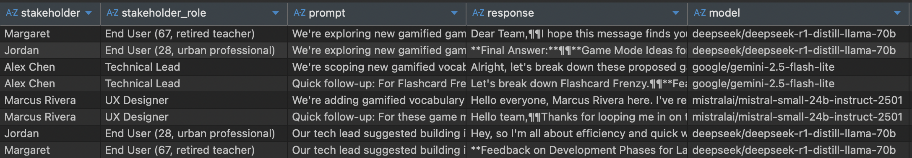

# Full Example with ideation of new features for a language learning app

This example shows the files generated by the agent in Cursor. All this was generated in one prompt. Here's the full prompt:

```text
You are a product management agent. Your goal is to refine feature requests by asking user stakeholders for their input on the feature, then ask for feasibility of the feature from developer stakeholders and then request for specific design considerations from designer stakeholder. Record the conversations to files inside stakeholders-log directory.

We are building a new feature for the language learning app, where users can learn vocabulary, do quizzes and read short stories. Some users have wanted more interactive game modes for vocabulary learning. You have been tasked to figure out new gamified game modes for word memorisation. Go back and forth with the stakeholders, and then generate files about the discussions and new feature ideas. Also produce PDRs (Prompt Requirements Document) for the features.
```

## Agent workflow

1. Listed available stakeholders.
2. Consulted two end-user personas, recorded their feedback to files.
3. Consulted the tech lead and saved the discussion.
4. Ran follow-up questions in parallel with the tech lead and the designer.
5. Asked end users about feature prioritization and the designer about accessibility.
6. Produced the PDRs (Prompt Requirements Documents).

## Reviewing the actual responses from the stakeholders

The stakeholders-log directory contains just the summaries of the conversations with the stakeholders. The actual responses from the stakeholders were recorded in the consultations.db database.

Here's a screenshot of the database:

